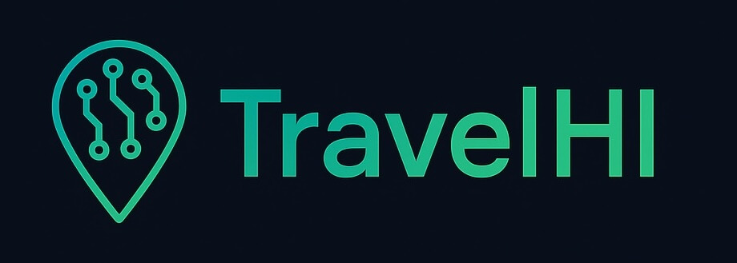
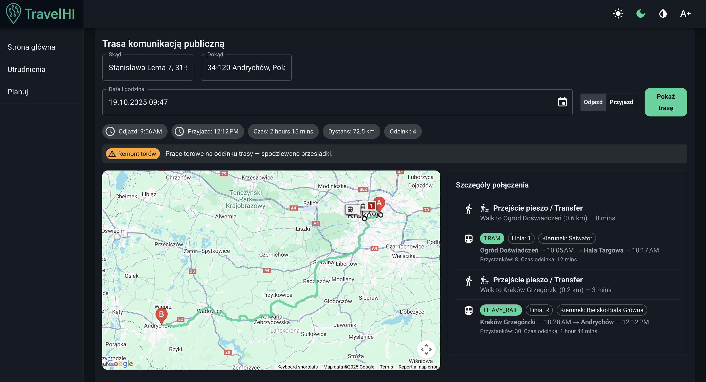
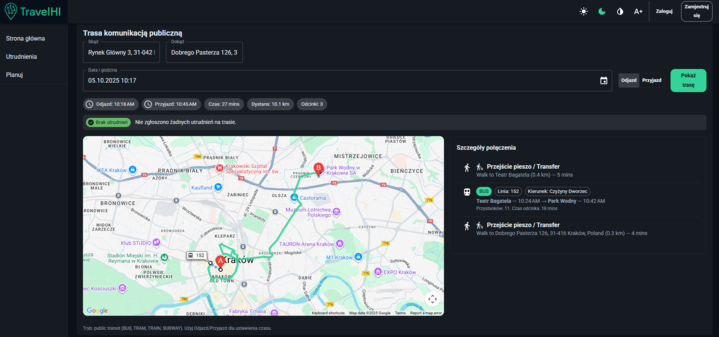
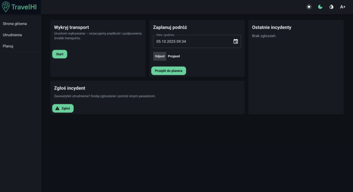
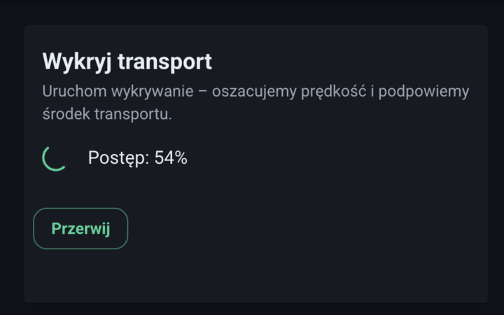
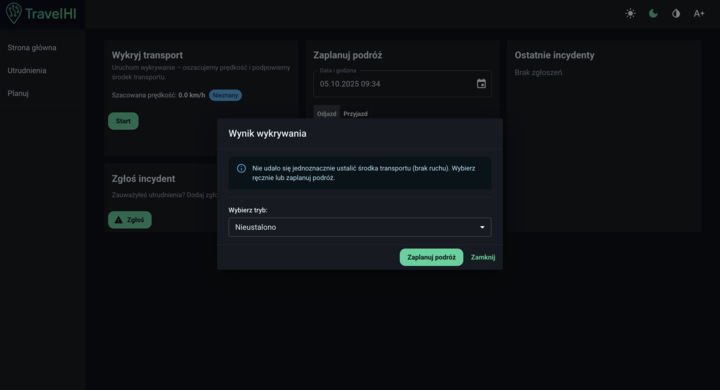
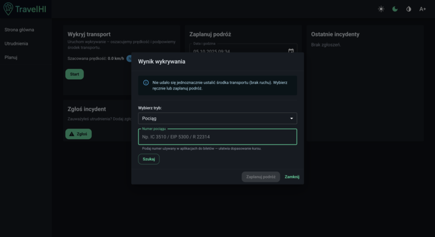
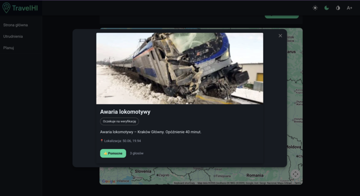
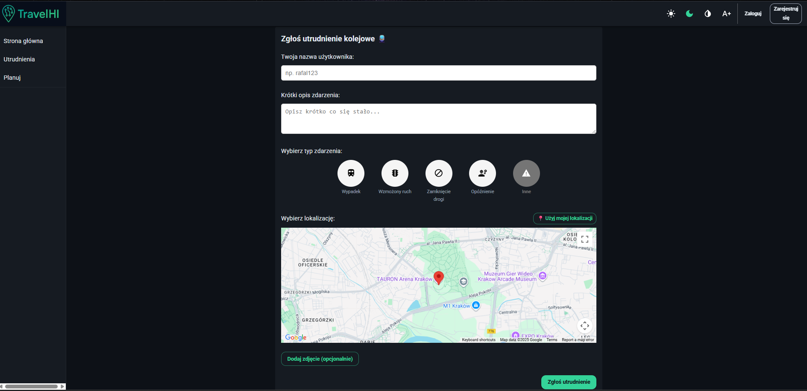
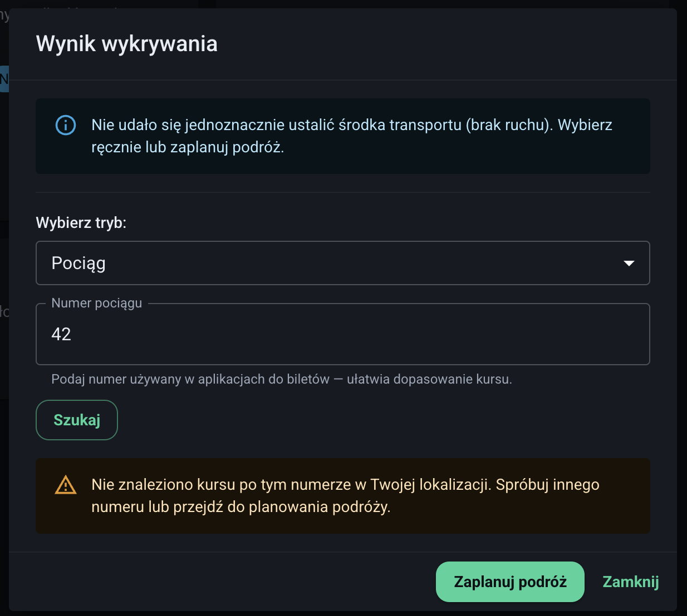

  

  

## Travel Hi API

  

  

---

## Project Overview

**Azeno** is a full‑stack application built during the HackYeach marathon to collect, visualize and score road events that affect land transportation. The app provides global real‑time mapping of incidents (accidents, roadblocks, delays, transport interruptions) and helps travelers plan safer, faster routes.

This repository contains both the **backend** (Python, FastAPI, Docker, SQLite) and the **frontend** (React + TypeScript). Performance, simplicity, and real‑time UX were the main design goals.

---

## 🔥 Key Features

* **Global Incident Map** — visualize events worldwide with geolocation markers and heatmaps.
* **User Accounts** — register, login, and manage your profile.
* **Report Incidents** — users can report road events (accidents, closures, delays) with optional photos and metadata.
* **Real‑time Route Overlay** — plan a route and see live disruptions along the path.
* **Scoring & Reputation** — users earn points for valid reports; LLM models help validate and score incoming reports.
* **AI‑assisted Moderation & Enrichment** — incoming texts and reports are enriched and filtered by lightweight LLM pipelines to classify severity and detect spam or abuse.
* **Cross‑platform UI** — runs in every modern browser, responsive and fast.

---

## Architecture & Tech Stack

* **Backend:** Python, FastAPI, Docker, SQLite for fast local prototyping
* **Frontend:** React, TypeScript, Vite (or Create React App)
* **Maps & Visualization:** Leaflet / MapLibre (open‑source), custom overlays
* **AI / LLM:** lightweight LLMs for text moderation, classification and enrichment of reports
* **Real‑time layer:** WebSockets (FastAPI / Socket.IO compatible) for pushing live updates to clients
* **Auth:** JWT tokens (stateless), with endpoints for registration, login and profile

---

## API Highlights

**Auth**

* `POST /api/auth/register` — register new user
* `POST /api/auth/login` — returns JWT token

**Reports**

* `GET /api/reports` — list reports (filter by bbox, time, type)
* `POST /api/reports` — create a new incident (auth required)
* `GET /api/reports/{id}` — get single report details

**Realtime**

* WebSocket endpoint: `/ws/updates` — subscribe to live incident updates for a given bounding box or route

---

## How AI is used

* **Moderation:** Submitted text and images are scanned by LLM pipelines for profanity, disallowed content, and spam patterns.
* **Classification:** Reports are enriched with predicted severity, probable transport modes affected, and suggested tags.
* **Scoring:** A hybrid rule + ML system computes a score for each report to reward accurate contributors and reduce noise.

*Note:* AI components are designed to be modular — they can be swapped for remote APIs or local LLMs depending on deployment constraints.

---

## Screenshots

  

  

  

  

  

  

  

  

  

---

## Contribution & Development Guidelines

1. Fork the repository and create a feature branch: `feature/your-feature`.
2. Keep commits small and descriptive.
3. Write unit & integration tests for backend routes and frontend flows.
4. Linting: `eslint` + `prettier` for frontend, `ruff`/`flake8` for backend.
5. Open Pull Requests to `main` with a short description, testing steps and screenshots.

---

## Roadmap (short)

* Improve LLM models for better report validation
* Add offline map caching for low‑connectivity scenarios
* Introduce paid premium plan for advanced analytics and historical incident exports

---

## Documentation

- [TravelHI pdf documentation HackYeah 2025](https://github.com/AzenoHI/travel_hi/blob/master/docs/TravelHI_doc.pdf)
- [TravelHI YouTube footage](https://www.youtube.com/watch?v=gT9ua37C5Mw)
- [Challengerocket.com overview](https://challengerocket.com/hackyeah-2025/works/travelhi-9252d3#go-pagecontent)
- [TravelHI online](https://travel-hi-gq4w.vercel.app/)

---

## Contact

*Azeno* Team — **05 October 2025** — *Hack Yeach challenge*

